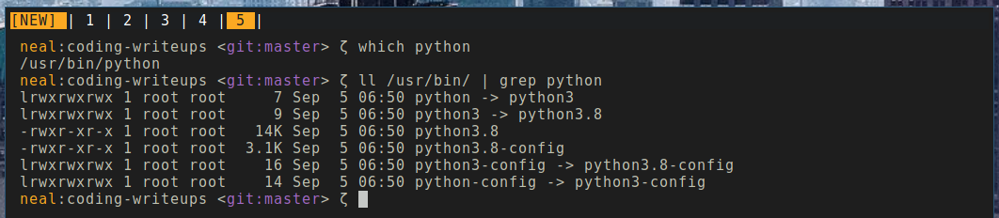
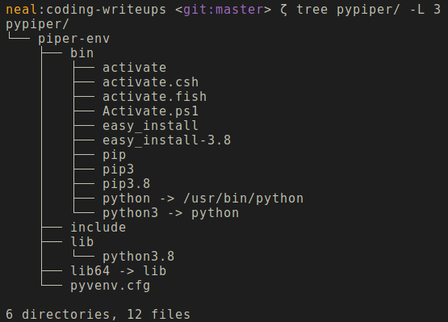

a newbie's guide to python

neal patel

license: mit

# basics

python is a dynamically-typed, interpretted language with (typically) no compile time checks.  

this means that static types (int, string, etc) are not declared in source code. however, you can use hinting in order to make code more readble. in my opinion, type hinting is a must when writing python code. using a library such as `pydantic` is (again, in my opinion) **necessary** with larger codebases.

the goal of any programmer is to have their code read like english. this should be true for *any* language that is used. the best code needs no comments. python is particularly great for this because of its pseudocode-like syntax. however, it is prudent to be aware of the limitations. python (cpython) is highly abstracted and much slower than lower level languages (java, c++, etc). do note for more advanced applications different interpreters exist: such as `PyPy` which uses JIT (just in time) compilation of python source code to machine-native assembly. this differs from `cpython`'s implementation which compiles to a bytecode intermediate that is used by a virtual machine (similar paradigm to the JVM).

# getting started

### python

determine the version of python installed: `$ python -V`.  
if your shell tells you that the command doesn't exist, it's likely python isn't installed on your system.  

**note:** i hate windows with a passion. i will exhibit great prejuidice for windows and python development on windows. if you're attempting to use windows, stop. get windows subsystem for linux/windows terminal at the very least. if you're passionate about using windows, then stop reading this guide.  

anyways, google `<your os> installing python 3.8`. read a few guides. figure out what they have in common. understand the commands. i realize that this is a "newbie's guide to python," but googling is an important skill. figure it out.

okay, so you have python installed. great. run `$ python -V` again. if this outputs `2.x.x`, then it is likely that your python command is symlinked to the deprecated python2 interpreter. 

to understand better what's happening under the hood, you need to understand how python is versioned.

`$ which <cmd>` will tell you where the binary for that file lives on your system.  

in my case, it is located in `/usr/bin/`. showing the contents of this directory with `ls -la` will show symlinks. symlinks are sort of like pointers for files to other files. you can see that by running `$ python file.py`, `which` tells me it will use `/usr/bin/python`. in turn, `/usr/bin/python` actually points to `/usr/bin/python3`. so i could've also run `$ python3 file.py` for the same effect. however, again, `/usr/bin/python3` points to `/usr/bin/pyhon3.8`. as seen in the listing, this is not a symlink. it is the actual python3.8 binary. so again, i could've run `$ python3.8 file.py` for the same exact effect.

why does this matter? well as time goes on new versions of python are realeased. in fact, python3.9 was released at the beginning of oct 2020. however, it's inadvisible to upgrade immediately since there are usually some interesting bugs/flaws. 

you want to continuously be able to upgrade at will, but without the pain of conflicting versions and package dependencies.

i would highly advise against changing symlinks around. if `python` is linked to `python2.x`, it's likely something on your system is using it. the reason my system doesn't exihibit this behavior is because i built it from scratch. python2 was never needed. instead, use the designated `python3` symlink.

okay, so back to python. now that you understand why `$ python <something>` actually does something, we can move on.

### pip

pip is the widely used package manager for python. it will install from the central repository. the same principles discussed above also apply to pip. running `$ which pip` will tell you where the binary lives. in addition, if you have python2 on your system, it's likely that you will need to use `pip3` instead of `pip` for the same reason you'd need to use `python3` instead of `python`.

again, if you do not have pip installed. google and install it.

now, any time that you're using the command line, you are inherently using a system-wide scope. so anything that is `pip` installed, will be installed system-wide. if you don't see how this is problematic, let me elaborate:

say you have a project that uses library=3.0.0 and another project that uses library=2.7.1; if you only install `library` system wide, you have no broken potentially one or both of these projects. in order to combat this, python development is often virtualized. **virtual environments** (hereforth venv) are key to python success. venv allows you to install libraries that are project-specific instead of system-specific. it's also a very clean way of rapidly prototyping and collaborating.

### venv

there's a few virtual environment tools. i used to use `virtualenv` from PyPi (pip central repo). however, python >3.5 supports it natively, so i recommend using that.

these environments are attached to your shell instance and denoted via `(env_name)` prepending your shell prompt (PS1). the beauty of these environments is that they are totally encapsulating.

# the hot, sexy start-up

### day 0

let's say we are a hot, sexy new start-up called PyPiper. we specialize in a ground-breaking new technology. we have decided to use the python stack to develop our product. as chief architect, it is your responsibility to get us off the ground.

start up your project root directory and call it `pypiper`. now we want to make sure that all our development in this environment will be congruent across our engineering team. we do not want [dependency hell](https://www.wikiwand.com/en/Dependency_hell).

we create a virtual environment called `piper-env`. this lives in the root directory of our project. now in order to do this, you're going to use the python interprettor (as discussed above) to run the following command:

`$ python -m venv piper-env`

now, in my case, `python -> python3 -> python3.8`. so i would effectively be creating a virtual environment in which the version of python used is 3.8; in addition, pip would also piggyback this version inside the environment.

so, this directory will be vast. in fact, all packages you install will eventually live here instead of where ever they live on your system. (note screenshot above is limited to depth of 3).

it is important to note that you have merely created our environment. you need to step into it before you can start using it! you will need to source the activation script in order to "step into" the environment.

`$ source piper-env/bin/activate`

now you will notice that your bash prompt looks different. this is because you are now in the environment. if you were using `python3` outside of the environment, now you can just use `python`. furthermore, confirm this is the case by running:

`(piper-env) $ python -V`

this should now reflect the same version of python that your out-of-environment, symlinked python binary created. 

i know this all seems complicated at first, but it will **really** help you going forward to understand this process and appreciate its elegance.

in addition, initialize a git repo. add a `.gitignore` and be sure to tell it to ignore the venv created... in this case: `piper-env`. then, make an initial commit. i'd also recommended setting up a remote via GitHub, GitLabs, etc.

### what's next?

so now that your environment is up and running, you're ready to start coding! the standard is to have a `requirements.txt` file that will allow anyone to easily see what packages you are using and to install them! 

`pip freeze` will list all packages in the current environment. use bash redirection in order to create/update the req file: `pip freeze > requirements.txt`. you can also install from a req file by running `pip install -r requirements.txt`. do you see how this could streamline your team of engineers?

in addition, `dotenv` is a commonly used python library to handle environment variables. so if your project requires the handling of secret keys, passphrases, etc., it's advisible to use `dotenv` and a project specific `.env` file in order to load environment variables from the project. this is more secure than having env variables be stored system-wide. 

from this point on, you can pretty much follow README.md instructions for your libraries word for word. see how great this is? 